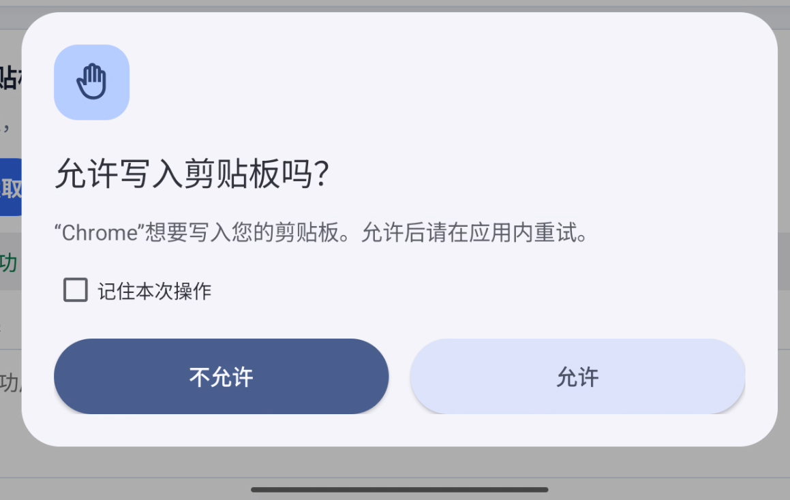
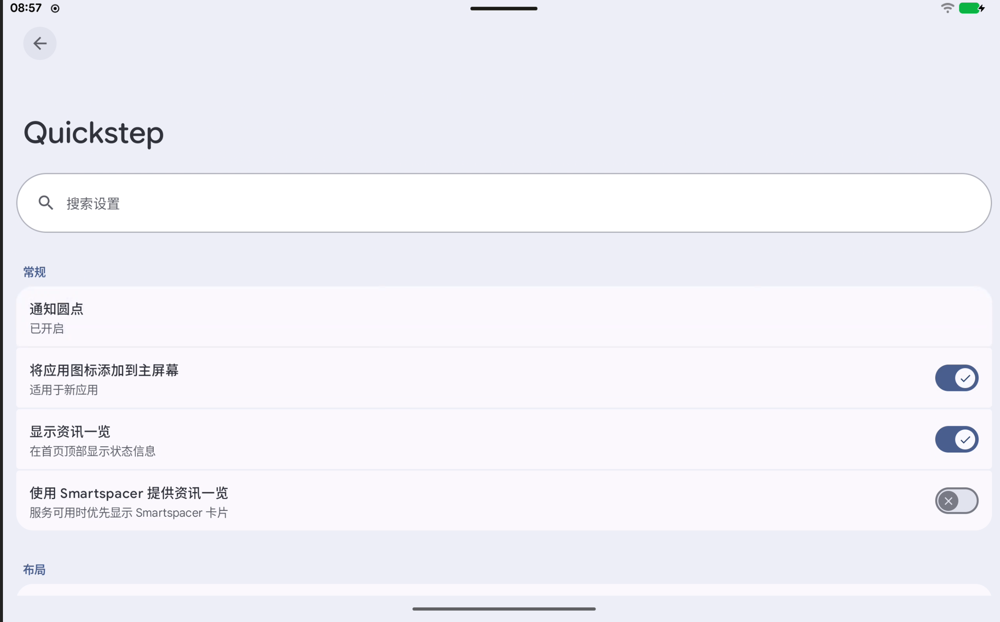
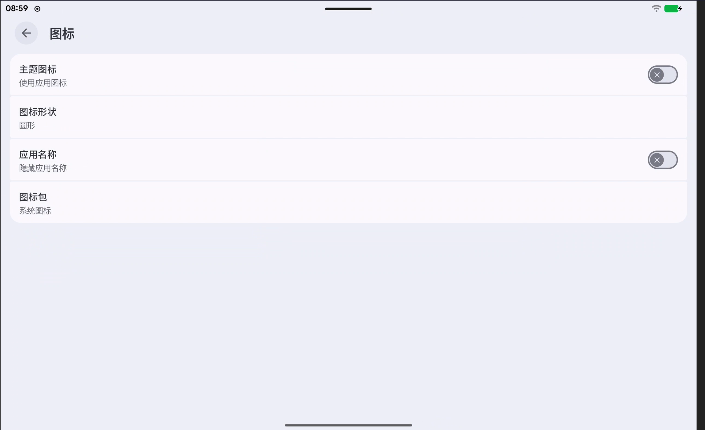
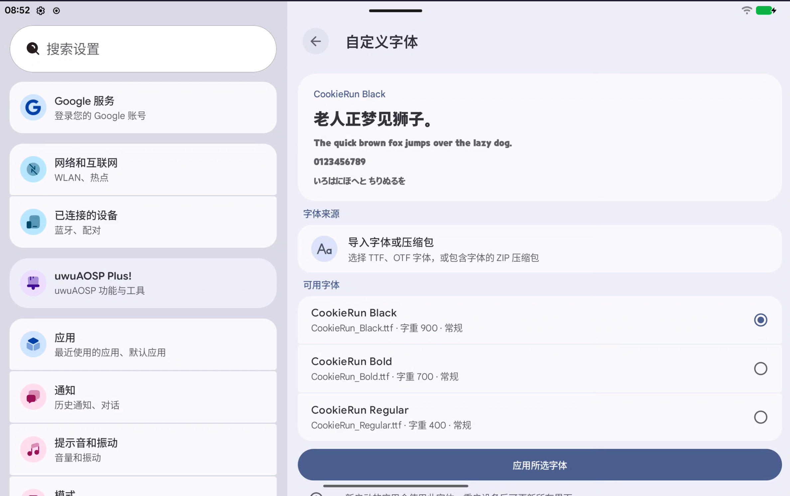
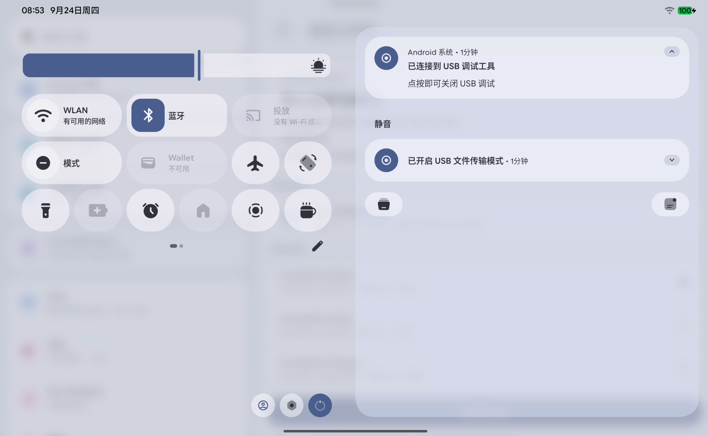
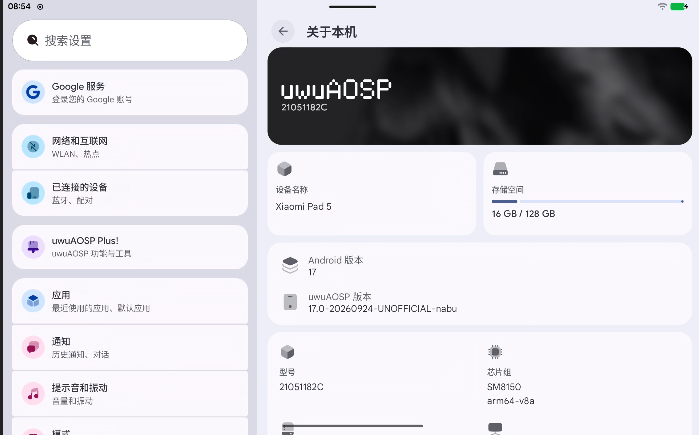

# uwuAOSP 17.0.100

[English](README.en.md) · [繁體中文](README.zh-tw.md) · [网站文章](https://uwuaosp.uwuniverse.org/blog/uwu-17.0.100/)

2026-09-25

经过数月的移植与打磨，uwuAOSP 17.0.100 已进入可以构建和体验的阶段。它基于 AOSP `android-17.0.0_r1`，带回了许多 16.2 用户熟悉的功能，也增加了新的选择。这次更新从一个常被忽略的操作说起：应用访问剪贴板。

## 剪贴板权限

复制一段文字后，哪些应用可以读取？应用写入剪贴板时，是否应该先问你？[应用剪贴板权限](https://uwuaosp.uwuniverse.org/docs/ClipboardAccess/)现在把读取与写入分开管理。每个应用都可以设为询问、允许或不允许。询问时，弹窗会说明是哪一个应用、要做什么；只有勾选“记住本次操作”，决定才会保存为规则。

<figure class="uwu-release-media">
  
  <figcaption>应用写入剪贴板前的询问窗口。读取与写入分别决定。</figcaption>
</figure>

手动复制、粘贴仍沿用系统原有的操作路径。[应用传感器访问](https://uwuaosp.uwuniverse.org/docs/AppSensorPolicy/)与[应用跳转控制](https://uwuaosp.uwuniverse.org/docs/appjumpinjection/)提供更多按应用管理的选项。[后台管理](https://uwuaosp.uwuniverse.org/docs/uwuBackGroundManager/)则用于选择应用离开前台后的运行方式。

## 桌面与外观

主屏幕的[一览区域](https://uwuaosp.uwuniverse.org/docs/LauncherAtAGlance/)可以显示日期、天气、闹钟、计时器和正在播放的音乐。Quickstep 也提供网格、图标和搜索设置，其中的图标页面支持选择桌面图标包。部分桌面能力借鉴或移植自 Lawnchair，感谢 Lawnchair 社区。

<figure class="uwu-release-media">
  
  
  <figcaption>Quickstep 的桌面设置与图标包选项。</figcaption>
</figure>

[自定义字体](https://uwuaosp.uwuniverse.org/docs/CustomFonts/)可以导入单个字体，也可以从 ZIP 压缩包里挑选。应用前可预览中文、英文、数字与日文。恢复默认字体时，导入的字体文件会被清除。

<figure class="uwu-release-media">
  
  <figcaption>选择字体后先预览，再应用到系统。</figcaption>
</figure>

[系统小图标](https://uwuaosp.uwuniverse.org/docs/SystemIcons/)可在默认与 PUI 两种风格间切换。PUI 资源来自天伞桜的作品，现已整理成随系统源码编译的覆盖层。

<figure class="uwu-release-media">
  
  
  <figcaption>PUI 在控制中心和系统页面中的实际效果。</figcaption>
</figure>

连接 USB-C、HDMI 或受支持的虚拟显示器时，[外接屏桌面](https://uwuaosp.uwuniverse.org/docs/ExternalDesktop/)可调用 Android 桌面模式，让应用在外接屏上以窗口运行。本机屏幕是否遮盖、scrcpy 虚拟屏是否触发桌面模式，都可以单独设置。此外，[状态栏歌词](https://uwuaosp.uwuniverse.org/docs/StatusBarLyric/)、[智能建议](https://uwuaosp.uwuniverse.org/docs/SmartSuggestions/)和[单独控制应用音量](https://uwuaosp.uwuniverse.org/docs/PerAppVolume/)也回到了日常体验中。

## 构建与维护

RinnRei 开发的 [Uni](https://uwuaosp.uwuniverse.org/docs/uni/)沿用 Soong、Kati 与 Ninja，并减少重复分析构建图的等待。它按构建阶段安排内核和主编译任务，根据可用内存调整高内存任务并发，中断后保留可复用的产物。日志保留各阶段与资源变化，方便定位失败原因。

在这台测试机的两次 clean build 记录中，Make 用时 5 小时 19 分 04 秒，Uni 用时 3 小时 43 分 04 秒。相差 1 小时 36 分钟，Uni 的总用时减少约 30.1%。测试机采用 Intel Core Ultra 5 125H、14 核 18 线程、32 GB 内存；Uni 使用 `-j18`。两次记录来自不同构建过程，源码状态和系统负载可能造成误差。

| Make · clean build | Uni · clean build |
| --- | --- |
| 5:19:04 | 3:43:04 |

下图取自另一场成功构建的 Uni 日志，展示最后阶段的 CPU、可用内存、swap-out 与 I/O wait 变化。它说明工具如何记录构建过程，不代表上面两次 clean build 的逐秒曲线。

[查看 Uni 运行时遥测图](https://uwuaosp.uwuniverse.org/docs/uni/#uni-runtime-telemetry)

[Uni 文档](https://uwuaosp.uwuniverse.org/docs/uni/)提供命令、计算公式、日志字段和测试条件。[Soong-only 构建流程](https://uwuaosp.uwuniverse.org/docs/soong-only/)与 [uwu_kernel](https://uwuaosp.uwuniverse.org/docs/soong-only/uwu_kernel/)仍在推进，为设备树迁移与内核增量编译提供路径。维护者也可以在设备树里填写姓名，让软件更新页面显示维护信息。

## 感谢与参与

感谢 AOSP、LineageOS、Lawnchair 和所有上游项目与贡献者。感谢提供测试设备、提交问题和完善翻译的社区成员。源码与文档都公开；发现问题时，可在 [Issue 页面](https://uwuaosp.uwuniverse.org/issues/website/)附上复现过程，或通过 [GitHub](https://github.com/uwuAOSP) 提交修改。

UwUniverse全体成员 2026.9.25 秋

